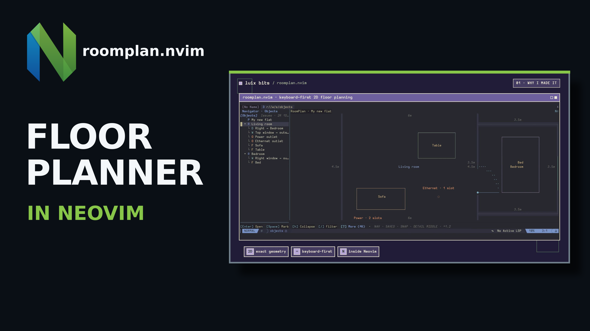
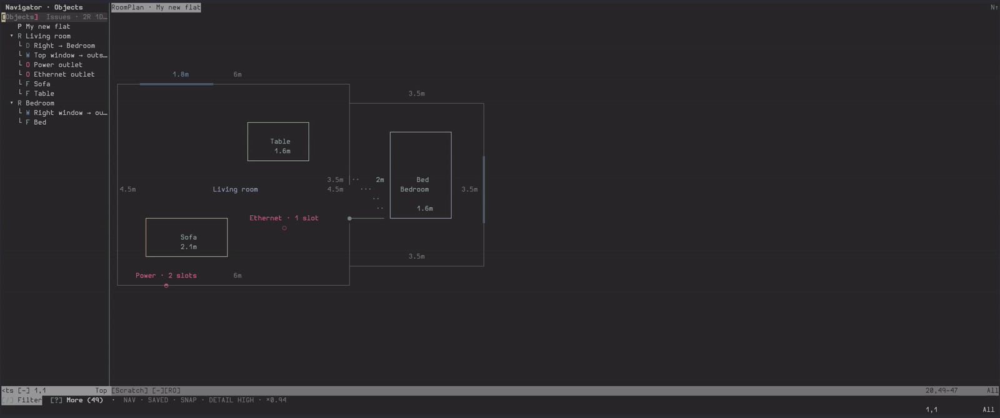

# roomplan.nvim

[](https://github.com/LuixBits/luixbits-roomplanner.nvim/actions/workflows/ci.yml)
[](LICENSE)

A keyboard-first floor planner for Neovim, backed by exact metric geometry.

## Showcase

[](https://youtu.be/bAPyriQQsNM)

[Watch on YouTube.](https://youtu.be/bAPyriQQsNM)



RoomPlan stores measurements as structured millimetre geometry. The terminal
canvas is an interactive view of that data, so display rounding never changes
the saved plan.

I started RoomPlan while planning a move. The tools I tried either had ads,
required a subscription, or I just did not like them.

RoomPlan is intended for space planning. It is not CAD, BIM, a construction
drawing tool, or a building-code checker.

## What it does

- Build rectangular, L-shaped, or connected multi-section rooms and furniture.
- Add single-leaf doors, wall windows, wall outlets, and floor outlets.
- Move and resize rooms and furniture, rotate furniture by 90 degrees, align
  rooms, and measure exact clearances.
- Review layout problems before saving.
- Import furniture catalogues from Lua or JSON.
- Save standalone JSON plans or embed them in a marked Norg block.
- Compare approximate clear-sky 2D sunlight exposure without a network
  connection.
- Keep several plans open with undo history and conflict-aware saving.

RoomPlan supports Neovim 0.10 and newer. It has no required runtime dependency.

## Install

With lazy.nvim:

```lua
{
  "LuixBits/luixbits-roomplanner.nvim",
  version = "*",
  lazy = false,
  main = "roomplan",
  opts = {},
}
```

With Neovim 0.12 `vim.pack`:

```lua
vim.pack.add({
  {
    src = "https://github.com/LuixBits/luixbits-roomplanner.nvim",
    version = vim.version.range("*"),
  },
})

require("roomplan").setup({})
```

These examples follow the newest tagged release. Remove `version` to follow
the development branch instead. The [installation
guide](docs/getting-started/installation.md) also covers exact pins, Nix, nvf,
rocks-git.nvim, native packages, and local development.

## Create your first plan

Create a standalone plan without overwriting an existing non-empty file:

```vim
:RoomPlanInit ~/plans/flat.roomplan.json
```

These keys are enough to begin:

| Key | Action |
| --- | --- |
| `a` | Add an object |
| `h j k l` | Move the canvas cursor |
| `e` | Edit exact properties |
| `m` / `r` / `R` | Move, resize, or rotate the selected object when supported |
| `s` | Save |
| `u` / `Ctrl-r` | Undo / redo |
| `?` | Show and search the actions available in the current context |

The [quick start](docs/getting-started/quick-start.md) builds a plan with two
rooms, furniture, a shared door, a window, and an outlet, then validates and
saves it.

Open an existing plan with:

```vim
:RoomPlanOpen ~/plans/flat.roomplan.json
```

## Documentation

| If you want to... | Start here |
| --- | --- |
| Install RoomPlan | [Installation](docs/getting-started/installation.md) |
| Build a complete first plan | [Quick start](docs/getting-started/quick-start.md) |
| Learn the workspace and controls | [Workspace overview](docs/workspace/overview.md) |
| Change settings, keys, colours, or glyphs | [Settings](docs/configuration/settings.md), [keymaps](docs/configuration/keymaps.md), and [appearance](docs/display/appearance.md) |
| Understand saving, migration, or conflicts | [Storage and sessions](docs/data/storage-and-sessions.md) |
| Diagnose a problem | [Troubleshooting](docs/reference/troubleshooting.md) |
| Use commands or Lua | [Commands](docs/reference/commands.md) and [Lua API](docs/reference/lua-api.md) |
| Check current limits and planned work | [Limitations and roadmap](docs/reference/limitations-and-roadmap.md) |

The [documentation home](docs/README.md) links every user and development
chapter. Inside Neovim, use `:help roomplan` for the offline reference and
`:checkhealth roomplan` for diagnostics.

## Compatibility and releases

The `main` branch is tested development source; tagged releases are the stable
installation targets. Plugin versions and saved-plan schema versions are
independent. The [compatibility policy](docs/development/compatibility.md)
lists the supported Neovim versions and public interfaces.

Release changes are recorded in [CHANGELOG.md](CHANGELOG.md).

## Contributing and support

Read [CONTRIBUTING.md](CONTRIBUTING.md) before changing the project. The
[architecture chapter](docs/development/architecture.md) describes the code
boundaries, and the [release checklist](RELEASE.md) contains the complete
gates.

Use [SUPPORT.md](SUPPORT.md) for questions and reproducible bug reports. Report
security issues privately as described in [SECURITY.md](SECURITY.md).

## License

RoomPlan is licensed under [GPL-3.0-only](LICENSE). Third-party notices are
recorded in [NOTICE](NOTICE).
