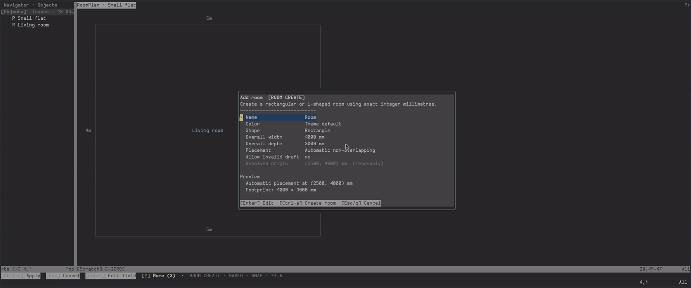

# Quick start

[← Installation](installation.md) · [Documentation home](../README.md) · [Next: Core concepts →](concepts.md)

This walkthrough creates two rooms, connects them with a door, adds furniture
and wall features, validates the result, and saves it.

## 1. Create a source

```vim
:RoomPlanInit flat.roomplan.json
```

The initializer refuses to overwrite a non-empty standalone file. The new
workspace starts with an empty-plan message and an Add Room action.

## 2. Add the first room

Press `a`. In the form:

1. Name the room `Living room`.
2. Set width to `5m` and depth to `4m`.
3. Leave automatic placement selected.
4. Press `Ctrl-s` to apply the complete draft.

RoomPlan accepts `5000`, `5000mm`, `500cm`, and `5m` as the same exact
measurement. The first room is selected and fitted automatically.

## 3. Add and align a second room

Press `a`, choose Room, and create a `3m × 3m` room named `Bedroom`. Select the
Bedroom in Navigator, press `A`, choose Living room as the reference, and place
the Bedroom east of it.

Read [Rooms and alignment](../planning/rooms.md) for every placement and
alignment option.



## 4. Connect the rooms

Press `D` and create a door on the Living room's east wall:

- width: `900mm`
- connection: Bedroom
- opens into: connected room

One stored doorway cuts the coincident wall of both rooms. Door ownership,
offsets, hinges, and swing direction are explained in
[Doors and shared walls](../planning/doors.md).

## 5. Add furniture

Press `F`, choose Living room and Sofa, then accept or edit its dimensions and
placement. Press `m` to move the selected sofa. Press `r` to resize it or `R`
to rotate it. Use `Esc` to leave MOVE mode.

## 6. Add a window and outlet

Press `W` to place a window on an exterior wall, then press `O` and choose a
wall or floor outlet. Wall outlets use inward-facing half circles; floor
outlets use full circles. The `a` Add menu offers the same choices with
lowercase `w` and `o`. See [Windows and
outlets](../planning/windows-and-outlets.md) for connections,
offsets, types, and current vertical-data limits.

## 7. Validate and save

Press `v` to run validation and focus Issues. Repair any errors, then press `s`
to save.

Use `q` to hide the workspace without unloading its session. Reopen it with:

```vim
:RoomPlanOpen flat.roomplan.json
```

Use `:RoomPlanClose` only when you want to unload the live plan and its undo
history.

## Next steps

Select a room and press `r` when you are ready to edit its footprint directly.
You can add or resize connected rectangular sections on the Canvas, then press
`s` to apply the complete preview. Press `m` instead to move the whole room and
its furniture. The [Rooms chapter](../planning/rooms.md) lists every
resize-mode key.

[← Installation](installation.md) · [Documentation home](../README.md) · [Next: Core concepts →](concepts.md)
