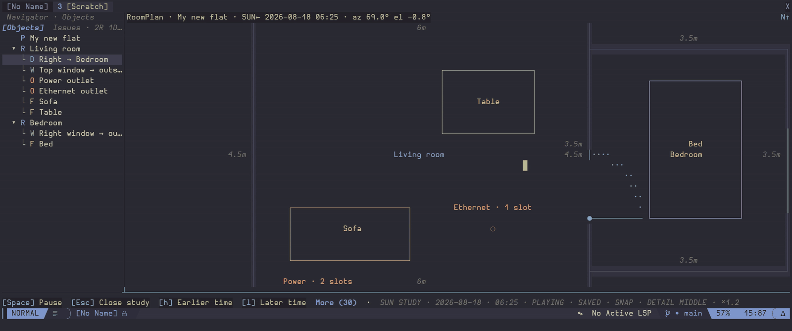

# Sun study

Sun study draws an approximate top view of sunlight entering through exterior
windows. It runs locally and does not need a network connection.

Press `S`, run `:RoomPlanSunStudy`, or choose **Sun study** from `?`.

## Set the site

The first study asks for three values:

- The clockwise angle from the top of the plan to geographic north.
- Latitude and longitude in decimal degrees.
- A fixed local UTC offset, such as `+02:00`.

The site is saved with the plan as one undoable change. The compass shows
`P↑` before a site is set. Afterwards it shows geographic north. Rotating the
view changes the screen compass but not the saved site.

RoomPlan does not look up time zones or daylight saving rules. Enter the UTC
offset that applies to the date you want to study.

## Choose a view

The popup offers three outputs:

- **View current time on canvas** shows one sunlight estimate.
- **Play whole day on canvas** animates the daylight period.
- **View daily exposure** adds the estimated direct sun minutes for each floor
  cell.

You can use today's date, an equinox, a solstice, or an exact date. The time
step and playback speed apply to the current study. They are not saved in the
plan.



## Canvas controls

| Key | Action |
| --- | --- |
| `h` / `l` | Step backward or forward in time |
| `j` / `k` | Move forward or back by three months |
| `Space` | Start, pause, resume, or restart playback |
| `S` | Pause and reopen the settings |
| `Esc` | Close the study |

Playback starts at sunrise and stops at sunset. It then shows daily exposure.
Press `3` to keep study details visible, or `?` to see the current controls.

The header shows the incoming light direction. Details shows the date,
sunrise, sunset, solar position, display type, and selected object exposure.

## Window heights

A window can store its own sill and head heights or use the configured
defaults. Explicit values must be nonnegative integer millimetres. The head
must be above the sill.

```lua
require("roomplan").setup({
  sun_study = {
    window_defaults = {
      sill_height_mm = 900,
      head_height_mm = 2100,
    },
    playback = {
      step_minutes = 60,
      frame_duration_ms = 700,
    },
  },
})
```

Exterior windows facing the sun cast a clipped floor patch inside their room.
Shared interior windows do not cast outdoor light. Daily exposure uses fixed
bands up to more than six hours, so different dates remain comparable.

## Accuracy and limits

Solar position uses a deterministic approximation in Lua. The result is a
clear-sky 2D estimate. It is useful for comparing layouts and times, but it is
not a construction or lighting simulation.

The study does not model weather, glare, reflections, thermal gain, wall
thickness, glazing, overhangs, terrain, or shadows from furniture height.

Closing the study stops playback and removes the overlay. It does not change
the plan or add an undo entry.

← [Windows and outlets](windows-and-outlets.md) | [Documentation home](../README.md) | [Furniture](furniture.md) →
